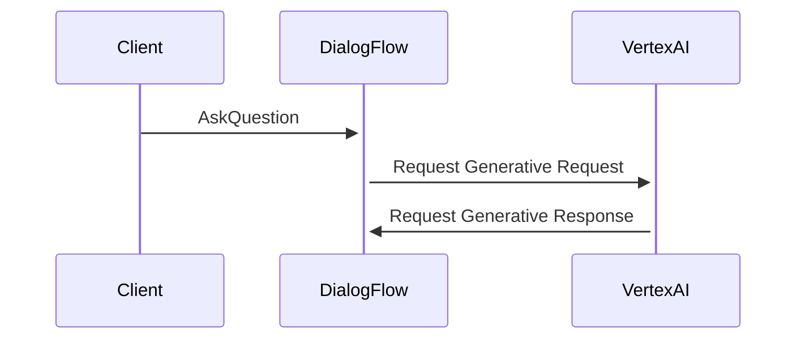
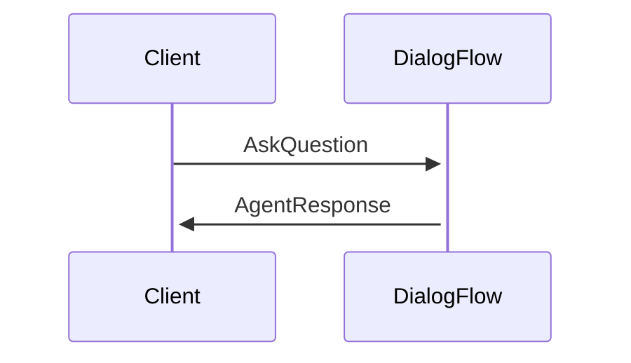
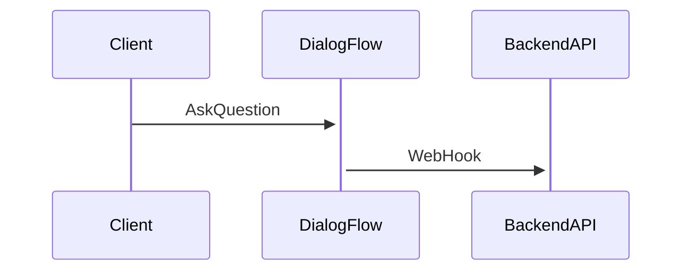

# Dialogflow CX 문서 

## Link 

- [Dialogflow CX 문서](https://cloud.google.com/dialogflow/cx/docs?hl=ko)
- [Dialogflow CX 설정 및 삭제](https://cloud.google.com/dialogflow/cx/docs/quick/setup?hl=ko)
- [Dialogflow - Concept](https://cloud.google.com/dialogflow/cx/docs/concept?hl=ko)
  - [Agent(에이전트)](https://cloud.google.com/dialogflow/cx/docs/concept/agent?hl=ko)
- [Dialogflow API usage overview](https://cloud.google.com/dialogflow/cx/docs/reference/api-overview)

## 기본적인 사용법 

### Manage 에서 intents 선택후 내가 사용할 Intents를 등록 할 수 있음. 

####  intents 
##### Training Phase에 등록된 데이터를 바탕으로 질문에 대한 답변을 조회할 수 있음. 

- Traingin Phase에는 질문을 등록할 수 있어서 다양한 질문 셋을 json으로 입력할 수 있게 되어 있음. 
]
##### [Intent Client](https://cloud.google.com/go/docs/reference/cloud.google.com/go/dialogflow/latest/cx/apiv3#cloud_google_com_go_dialogflow_cx_apiv3_IntentsClient)

### Build에서 질문에 대한 답변을 위한 데이터를 생성할 수 있음. 

#### Generators 

해당 건의 경우 DataStore를 통해서 실제 내가 필요로 하는 데이터를 효과적으로 가져올 수 있다. 

- Generator를 이용한 생성형 AI 모델 구성하기 
    - [Generators](https://cloud.google.com/dialogflow/cx/docs/concept/generative/generators?hl=en)

#### Agent Responses 

#### Webhook settings 

- Webhook을 이용한 Custom한 AI 모델 구성하기 
    - [WebHook](https://cloud.google.com/dialogflow/cx/docs/quick/webhook?hl=en)

